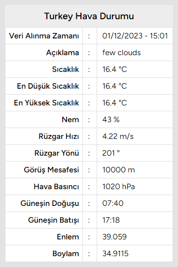
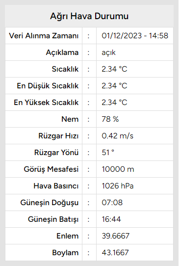
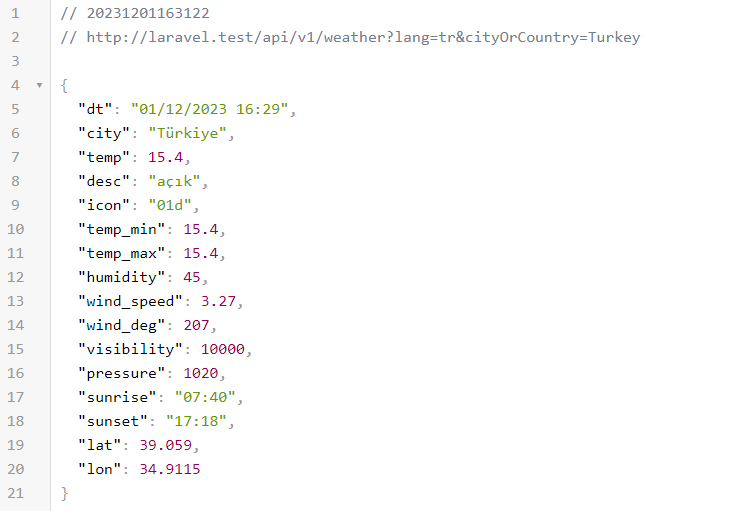

<p align="center"><a href="https://laravel.com" target="_blank"></a></p>

## Weather API ile Hava Durumu
- Laravel 10.x ve Weather API kullanılarak geliştirilmiştir.
- Weather API için [OpenWeather](https://openweathermap.org/current) kullanılmıştır.
---

## Kurulum

### 1. Projeyi klonlayın:
```bash
git clone https://github.com/erhanurgun/LARA19-weather-api-ile-hava-durumu.git lara-weather-app
```

### 2. Composer paketlerini yükleyin:
```bash
composer install
```

### 3. `.env` dosyasını oluşturun:
```bash
cp .env.example .env
```

### 4. Uygulama anahtarı oluşturun:
```bash
php artisan key:generate
```

### 4. `.env` dosyasını kendinize göre düzenleyin:
```bash
APP_NAME="Weather API ile Hava Durumu"
APP_URL=http://localhost:8000
APP_TIMEZONE=Europe/Istanbul
APP_LOCALE=tr
APP_FAKER_LOCALE=tr_TR

WEATHER_API_KEY=
WEATHER_API_URL=https://api.openweathermap.org/data/2.5

DB_CONNECTION=mysql
DB_HOST=127.0.0.1
DB_PORT=3306
DB_DATABASE=
DB_USERNAME=
DB_PASSWORD=
```

### 5. Veritabanı tablolarını oluşturun:
```bash
php artisan migrate
```

### 6. Uygulamayı çalıştırın:
```bash
php artisan serve
# veya
php artisan serve --host=laravel.test --port=8000
# veya
php -S localhost:8000 -t public
```
- **NOT:** Eğer `laravel.test` şeklinde erişmek isterseniz; 
- - Windows için `C:\Windows\System32\drivers\etc\hosts` dosyasına `127.0.0.1 laravel.test` satırını ekleyin.
- - Linux için `/etc/hosts` dosyasına `127.0.0.1 laravel.test` satırını ekleyin.
- - Mac için `/private/etc/hosts` dosyasına `127.0.0.1 laravel.test` satırını ekleyin.

### 7. Uygulamaya tarayıcı üzerinden erişin:
```bash
http://localhost:8000
# veya
http://laravel.test
```
---

## Kullanım Örneği
- Ülke için:
```bash
http://laravel.test/weather?lang=en&cityOrCountry=Turkey
```
- Şehir için:
```bash
http://laravel.test/weather?lang=tr&cityOrCountry=Ağrı
```
- **NOT:** `lang` parametresi opsiyoneldir. Varsayılan değeri `tr`dir.

## Ekran Görüntüleri




## Kullanılan Paket

- [PHP Guzzle](https://packagist.org/packages/guzzlehttp/guzzle)
---

Daha fazla bilgi için bu adresleri ziyaret edebilirsiniz:

- `forum` | [forum.erho.dev](https://forum.erho.dev)
- `blog`  | [erho.dev](https://erho.dev)
- `blog`  | [orizora.com](https://orizora.com/blog)
